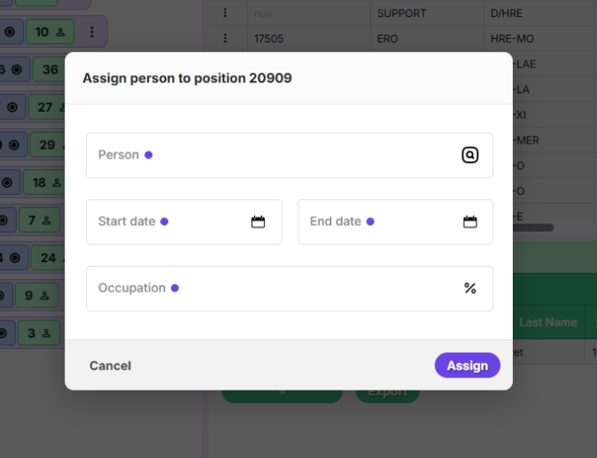
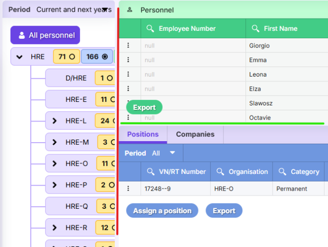
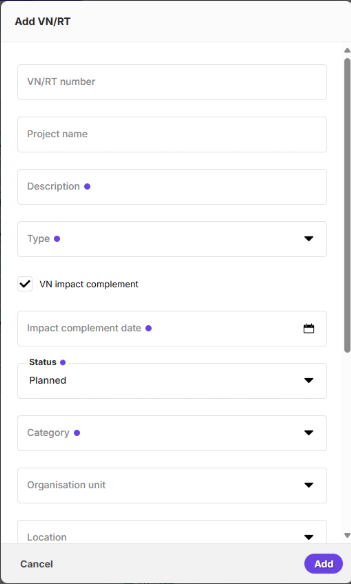
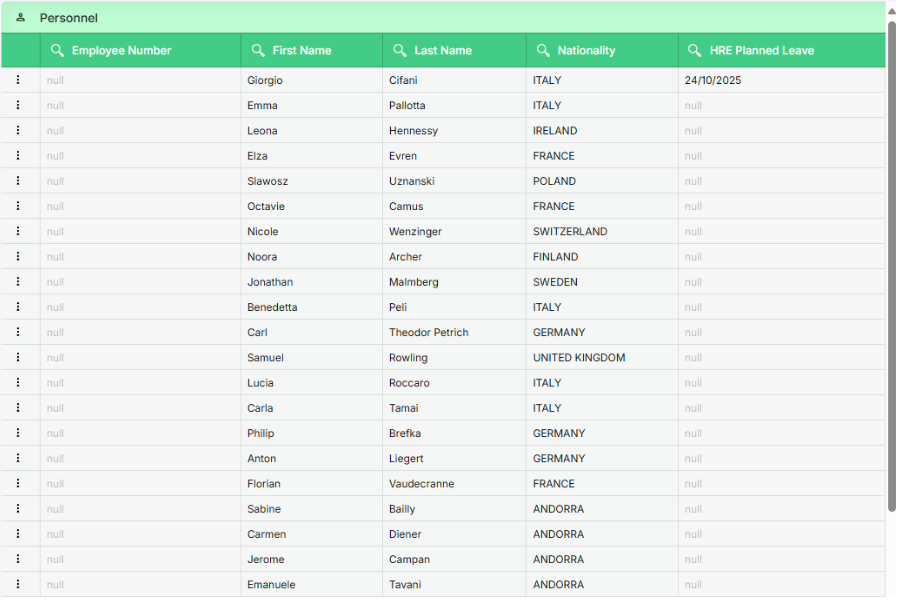

# Packster Doc 
Packster est un framework permettant le développement rapide d'applications web. Ce framework est divisé en deux parties : le côté client (frontend) et le côté serveur (backend). Certaines parties du framework ne seront pas explicitées pour faciliter la compréhension.

# Installation

## Prérequis

Le système d’exploitation requis est **Linux**. Il est possible d’utiliser le Windows Subsystem for Linux (WSL) pour les environnements de développement, cependant l’utilisation d’une machine Linux est fortement recommandée pour la production.

Il est également nécessaire de dispoer des droits d'administrateur **pour la mise en production**.

## Architecture du projet

Extrayez Packster dans le dossier de votre choix, par exemple `/srv`, et renommez le dossier extrait avec le nom que vous voulez donner à votre projet. Vous y trouverez deux dossiers principaux : 

#### Frontend/ 
- `runtime.json` : manifest du frontend, contient notamment les métadonnées comme les routes et le port de développement 
- `src/` : code principal du frontend 
	- `main.ts` : point de démarrage du client 
	- `classes.ts` : liste des toutes les classes utilisées par le serveur. Si une classe ou un fichier est créé, il faudra le rajouter dans la liste d’export. 
	- `assets/` : images, icones, png 
	- `classes/` : dossier contenant le gros du code 
		- `pages/` : pages de l’application.
#### Backend/
- `runtime.json` : manifest du backend
- `node_modules/` : dossier contenant les bibliothèques d’outils npm 
- `store/` : contient les fichiers json de connexion aux bases de données 
- `src/` : code principal du backend 
	- `main.ts` : point de démarrage du serveur 
	- `classes.ts` : liste des toutes les classes utilisées par le serveur. Si une classe ou un fichier est créé, il faudra le rajouter dans la liste d’export. 
	- `classes/` : dossier contenant le gros du code 
		- `http-controllers/` : contient les contrôleurs permettant de déclarer les endpoints API. Ces contrôleurs se servent des modèles pour interagir avec la base de données. 
		- `postgres-models/` : contient un dossier par modèle ; un modèle est composé de deux fichiers, un pour représenter la table et un pour représenter une ligne de table en base. 

## Node.js

Packster repose sur Node.js pour fonctionner. Pour cela, suivez la procédure renseignée [ici](https://nodejs.org/en/download).

Exemple d'installaion de la version 24.11 via nvm : 

```bash
# Download and install nvm:
curl -o- https://raw.githubusercontent.com/nvm-sh/nvm/v0.40.3/install.sh | bash
# in lieu of restarting the shell
\. "$HOME/.nvm/nvm.sh"
# Download and install Node.js:
nvm install 24
# Verify the Node.js version:
node -v # Should print "v24.11.0".
# Verify npm version:
npm -v # Should print "11.6.1".
```

## NGINX

NGINX est le serveur web recommandé pour utiliser Packster.
Il permet d’héberger plusieurs sites sur une même machine grâce aux virtual hosts, qui intègrent la fonctionnalité de reverse proxy. L'avantage de cette méthode est qu'NGINX gère les handshakes HTTP en amont.

La première étape consiste donc à installer NGINX à l’aide de votre gestionnaire de paquets.
Par exemple, avec APT :

```bash
sudo apt install nginx
```

### Virtual Hosts

Un virtual host est une gestion virtuelle de votre application web. On peut ainsi héberger plusieurs projet sur une même machine.

Le principe est d'avoir un domaine principal, séparé en deux-sous domaines : un pour la partie développement, et un pour la partie production. 

Pour ce faire, accédez à l'interface web de votre hébergeur, puis rendez vous dans la section réservée à la zone DNS de votre domaine. Dans notre exemple, nous prendrons my-site.com et nous aurons deux sous-domaines : dev.app1.my-site.com et app1.my-site.com.

Maintenant que la zone DNS est configurée, nous pouvons passer à la création du fichier virtual host dans `/etc/nginx/sites-available`, puis créez un lien symbolique dans `/etc/nginx/sites-enabled` pour l'activer.

Exemple de création de virtual host : 

```bash
sudo cd /etc/nginx/sites-available
# Référez vous à l'exemple ci-dessous pour créer votre virtual host
sudo nano my-site.com
cd ../site_enabled
sudo ln -s ../sites-available/my-site.com .
```

```bash
#exemple nginx
#assurez vous que les ports declarés dans runtime.js etc etc
```
Pour que cette configuration HTTPS marche correctement, il faut générer deux certificats, un pour chaque sous-domaine. Vous pouvez soit les acheter soit utiliser [certbot](https://certbot.eff.org/) pour les générer gratuitement. Rendez vous [ici](https://certbot.eff.org/) pour les instructions d'installation de certbot pour nginx.

Une fois certbot installé, executez ces commandes pour générer vos certificats:
```bash
sudo certbot --nginx --d dev.app1.my-site.com
sudo certbot --nginx --d app1.my-site.com
```

## Développement

Pour démarrer votre serveur de développement, placez dans votre dossier frontend, et lancez le runtime de développement : 

```bash
cd /srv/my-site/frontend
./run -d
```

puis lancez le backend de la même manière : 

```bash
cd /srv/my-site/backend
./run -d
```

### Production

Le prérequis pour mettre votre site en production est de configurer deux services, un pour le backend et un pour le frontend. Ces services, une fois démarrés, tournent en continu en arrière plan. C'est dans ces fichiers services que les ports de production sont spécifiés et doivent correspondre aux ports du virtual host.

Exemple de configuration de service systemd backend :

```bash
cd /etc/systemd/system
# Référez vous à l'exemple ci-dessous pour créer votre service backend
sudo nano app1-backend.service 
```

```
[Unit]
Description=app1-backend
After=network.target

[Service]
Type=simple
User=dnme
WorkingDirectory=/srv/app1/backend/runtime/dist/main/build
ExecStart=/usr/bin/node index.esb-min.js 11101
Restart=on-failure

[Install]
WantedBy=multi-user.target
```

Exemple de configuration de service systemd frontend :

```bash
cd /etc/systemd/system
# Référez vous à l'exemple ci-dessous pour créer votre service frontend
sudo nano app1-frontend.service 
```

```
[Unit]
Description=tms-frontend
After=network.target

[Service]
Type=simple
User=dnme
WorkingDirectory=/srv/tms/frontend
ExecStart=node runtime/production-server/index 11201 --tms-frontend
Restart=on-failure

[Install]
WantedBy=multi-user.target
```


# Frontend
Le principe du Frontend de Packster est de ne jamais écrire de HTML. Pour décrire la structure de la page, le framework propose d’utiliser un équivalent encapsulé des méthodes de manipulation du DOM Javascript avec la classe Block.
## Créer une page
La première étape de développement d’une application web est de créer une page. Il suffit pour cela de créer un nouveau dossier dans `frontend/src/classes/pages`, qui portera le nom de notre nouvelle page, afin de garder une organisation propre. Nous créerons dans ce dossier un fichier portant le nom de la page, qui contiendra notre classe héritant de `Page` ou `TitledPage` . Nous prendrons dans cet exemple une page permettant la gestion de catégories. 

**Remarque** : Chaque fois qu’un composant graphique frontend est créé (page ou composant classique), il faut l’exporter dans le fichier `frontend/src/classes`.ts, on peut retrouver la déclaration des pages en bas du fichier.

Nous pourrons dans ce dossier stocker également les composants graphiques propres à cette page : Tables, Popups, etc.

```typescript
export class CategoriesPage extends TitledPage { 
	constructor() { 
		super('Categories', 'categories'); this.init(teamId); 
	}
}
```

Il nous faut ensuite attribuer une route (URL) à notre page. Pour cela, il faut ajouter la route au démarrage du client, dans le fichier `frontend/src/classes/Client.ts` :

```typescript
public async onConnected() : Promise<void> {

	...

	this.router.setRoutes({
		'/tasks': TasksPage,
		'/settings/teams': TeamsPage,
		'/me': MePage,
	});
}
```

Et dans le fichier frontend/runtime.json :

```json
"pages": [
	{ "path": "/", "title": null, "description": "" },
	{ "path": "/login", "title": "Login", "description": "" },
	{ "path": "/me", "title": "My account", "description": "" },
	{ "path": "/tasks", "title": "Tasks", "description": "" },
	{ "path": "/documents", "title": "Documents", "description": "" },
	{ "path": "/team", "title": "Team", "description": "" }
]
```

Pour rediriger l’utilisateur sur la page (changer l’URL/la route), on utilise
```typescript
ClientLocation.get().router.route("/URL")
``` 

## Les composants graphiques 

Une fois notre page obtenue, il va falloir la remplir avec des composants graphiques : tables, boutons, etc.

### Créer son composant graphique : la classe Block

Pour créer son composant graphique, il suffit de créer une classe étendant la classe Block.ts : 


```typescript
import { Block } from '@src/classes';

export class MonComposant extends Block {

    constructor(attributes?: any, parent?: Block) {
       
        super('div', attributes, parent);
    }
}
```

La classe block, quand instanciée, attend en paramètre plusieurs choses : 

```typescript
constructor(
	private tag: any,
	private attributes?: any,
	parent?: any /*Block | HTMLElement*/
) { ... }
```

- tag : le type d’élément HTML voulant être créé (div, span, li, p, etc.)
- attributes : les attributs de l’élément HTML (class="", etc.)
- parent : l’élément HTML parent de notre block dans la hiérarchie du document.

**Remarque** : Les Pages (héritant de TitledPage ou Page) possèdent un attribut "content", qui est l’élément HTML représentant de le contenu de la page. Lorsque l’on veut ajouter du contenu à une Page, il faut donc passer page.content comme block parent.

La classe Block propose une encapsulation des méthodes proposées nativement en JS pour manipuler le DOM. On peut même accéder au HTMLElement de base, qui est un attribut du Block. Nous vous conseillons d’aller lire le code et la documentation technique de Block.ts en entier pour faciliter la compréhension du côté frontend : il s’agit du cœur de la logique.

### Les composants prédéfinis

Pour faciliter le développement d’applications, Packster vient avec une collection de composants prédéfinis.

#### Div

l’élément HTML Div de base.

#### Button


Un composant bouton, qu’il faudra ensuite relier à des évènements pour utiliser (voir plus loin : programmation des évènements).

#### Popup



Ce composant fait apparaître une fenêtre par-dessus le contenu affiché, et propose les fonctionnalités classiques d’une popup (refermable facilement, etc.)

#### HorizontalSplit et VerticalSplit


*En rouge un HorizontalSplit, en vert un VerticalSplit*

Ces composants possèdent chacun deux blocks : un block gauche et un block droit pour le horizontal split, et un block haut et un block bas pour le vertical split. 
Chaque block peut accueillir n’importe quel autre composant graphique, et permet de créer des fenêtres séparées resizable facilement. 

#### Chooser


Composant comportant un ensemble de boutons sélectionnable uniquement un à la fois. Permet la récupération des évènements pour par exemple gérer l'affichage de fenêtres.

#### Form



Composant permettant la gestion de formulaires, avec différents types d’inputs. Nous vous conseillons de lire le code et les docstring de ces classes trouvable dans frontend/src/classes/form.

#### Table



Un composant tableau permettant des fonctionnalités comme le tri par colonnes ou encore la recherche. Nous vous conseillons également de consulter plus amplement la doc du code pour bien en saisir les subtilités.

#### DataTable

Ressemble graphiquement à la Table classique présentée plus haut. La particularité de ce composant réside dans la manière dont les données sont chargées : combinées à l’utilisation des “fetchers” en backend, elles permettent une chargement progressif des données, utile si on souhaite afficher des tables contenant énormément de données.

## Programmation réactive par évènements

Pour programmer des évènements permettant d'ajouter/supprimer des blocks, changer de pages, etc. nous avons à notre disposition les classes `Emitter` ainsi que la méthode `onNative` de la classe `Block`.

### Emitter

La classe `Emitter` est l’un des piliers du fonctionnement interne de Packster.
Elle introduit un système de programmation par événements similaire à celui du navigateur ou de Node.js, mais simplifié et uniformisé pour l’ensemble du framework.

Concrètement, elle permet à n’importe quelle classe d’émettre des signaux (`emit`) et à d’autres objets de réagir à ces signaux (`on`).
Chaque signal est identifié par un nom d’événement (ex. "click", "update", "ready", etc.), et peut transporter des données associées.

La plupart des composants du frontend héritent de Emitter : les boutons (`Button`), les blocs graphiques (`Block`), les tables, ou encore la classe `Api`.
Cela leur permet de notifier le reste de l’application lorsqu’une action se produit : clic utilisateur, mise à jour de données, chargement terminé, etc.

Voici un exemple simple illustrant le fonctionnement :

```typescript
import { Emitter } from '@src/classes';

// Création d’un émetteur d’événements
const emitter = new Emitter();

// On écoute un événement "ready"
emitter.on("ready", () => console.log("L’application est prête !"));

// On émet l’événement
emitter.emit("ready");
// → Affiche "L’application est prête !"
```

Chaque appel à `on()` retourne un objet `Listener`, qui encapsule l’écoute et offre une méthode `off()` pour se désabonner facilement :

```typescript
const listener = emitter.on("update", (data) => {
  console.log("Mise à jour reçue :", data);
});

// Plus tard…
listener.off(); // stoppe l’écoute
```

Enfin, une classe héritant de Emitter peut supprimer tous ses écouteurs via `this.clearListeners()`,
utile lorsqu’un composant est détruit pour éviter les fuites mémoire.

En résumé :

- Emitter permet de découpler les composants entre eux via un système d’événements léger ;
- il facilite la communication interne du frontend sans dépendances extérieures ;
- et il constitue la fondation de la logique réactive du framework.

### onNative

Alors que la classe `Emitter` gère les événements internes du framework (propres à Packster),
la méthode `onNative()` permet, elle, d’écouter directement les événements natifs du DOM,
comme les clics, les mouvements de souris ou les frappes clavier.

Chaque instance de `Block` encapsule un véritable élément HTML (`this.element`).
`onNative()` offre un moyen simple et cohérent d’y attacher un listener natif, sans manipuler le DOM directement.

Voici un exemple concret :

```typescript
import { Block } from '@src/classes';

const button = new Block('button');
button.write('Cliquez-moi');

// On écoute un clic natif sur le bouton
button.onNative('click', () => {
  console.log('Bouton cliqué !');
});
```

Cette méthode retourne toujours le `Block` lui-même (`this`),
ce qui permet de chaîner les appels pour écrire du code plus fluide :

```typescript
new Block('div')
  .onNative('mouseenter', () => console.log('Survolé'))
  .onNative('mouseleave', () => console.log('Sorti'));
```

## Les classes SCSS

Toutes les classes scss permettant de personnaliser l’affichage des composants se trouvent dans `frontend/src/scss`. Si besoin est de créer de nouvelles classes, il revient au développeur de créer un fichier scss ou non, selon l’architecture souhaitée. Les variables scss utilisées dans les classes par défauts sont modifiable sous `frontend/src/scss/variables`.

Par défaut, de nombreuses classes sont présentes dans le framework, permettant de facilement développer quelque chose d'esthétique si on utilise les composants graphiques et classes sccs de base.

# Lier Frontend et Backend : la classe frontend Api

La classe Api fournit une interface centralisée permettant au frontend de communiquer facilement avec le backend.

Elle encapsule toute la logique d’envoi de requêtes HTTP (GET, POST, etc.), la gestion des paramètres, le suivi d’état d’authentification et la gestion des événements liés à la connexion de l’utilisateur.

L’objectif est d’offrir un point d’accès unique à toutes les interactions avec l’API, afin de standardiser la manière dont les données sont échangées dans l’application.

| Élément | Description |
|------------|------------|
| `accountData` | Contient les informations du compte utilisateur connecté (identifiant, droits, etc.). Si aucune session n’est active, vaut null. |
| `checkAuth()` | Vérifie l’état de la session en interrogeant le backend. Met à jour accountData et émet des événements. |
| `clearAuth()` | Supprime le token d’authentification stocké dans le navigateur. |
| `get()`, `post()` | Envoient des requêtes HTTP classiques. |
| `getBinary()` | Télécharge une ressource binaire (image, fichier, etc.). |
| `request()` | Méthode interne générique utilisée par toutes les autres. |
| `getBaseURL()` | Retourne l’URL complète de base pour l’API (https://host/api). |

## Authentification

Lorsqu’un utilisateur se connecte, un token d’authentification est enregistré dans le `localStorage`.

La méthode `checkAuth()` permet ensuite de :
- Vérifier la présence du token ;
- Interroger l’API (`/me`) pour récupérer les informations du compte ;
- Déterminer si l’utilisateur est authentifié.

Deux événements sont alors émis :
- `connected` : la session est valide et accountData contient les données de l’utilisateur
- `not-connected` : aucun token valide n’a été trouvé ou la vérification a échoué.

L’application peut écouter ces événements pour afficher dynamiquement les interfaces de connexion, profil, etc.
Nous vous conseillons de consulter le code et les docstring trouvables dans `fronted/src/classes/network/Api.ts`

# Backend

Le backend propose une base simple et structurée pour créer des API REST connectées à une base de données (ici, nous donnerons les exemples avec PostGre SQL, mais il en va de même pour Oracle). Il repose sur deux classes fondamentales :

- `PostgresTable` : représente une table en base de données, et permet d’effectuer des opérations SQL globales (sélection, insertion, suppression, etc.).
- `PostgresTableEntry` : représente une ligne de cette table (un enregistrement), et offre des méthodes pour manipuler les champs d’une entrée donnée.

Sur cette base, chaque table de la base de données est associée à un modèle (classe dédiée), qui peut implémenter des opérations plus spécifiques.
Enfin, un contrôleur définit les endpoints REST exposés par l’API et utilise ces modèles pour exécuter la logique applicative.

## Connecter une base de données

Pour renseigner l’adresse de la base de données, il suffit simplement de modifier le fichier json `backend/store/postgresql.json` ou `oracle.json` en fonction du SGBD utilisé : 

```json
{
    "host": "localhost",
    "port": 5433,
    "database": "my_db",
    "user": "my_user",
    "password": "my_password"
}
```

## Créer un Modèle

Un modèle correspond à une table spécifique en base. Il est composé de deux classes : une qui hérite de `PostgresTable` pour représenter la table, et une qui hérite de `PostgresTableEntry` pour représenter une entrée de la table.
Les modèles servent à :
- encapsuler les opérations SQL courantes sur une table ;
- offrir des méthodes plus riches adaptées à la logique métier ;
- simplifier l’utilisation dans les contrôleurs.

**Remarque** : de la même manière que du côté frontend, il faudra exporter toute classe créée (que ce soit modèle ou contrôleur) dans `backend/src/classes.ts`

### Postgres

`Postgres` est la classe qui s’occupe de la connexion à la base et de l'exécution du SQL. Elle contient notamment les méthodes :

```typescript
static async getRows(query: string, params: any = []) : Promise<any>
static async getRow(query: string, params: any = []) : Promise<any>
```

Qui permet d’exécuter n’importe quel code SQL et d’en récupérer le résultat entier pour la première et uniquement la première ligne pour la seconde. 

### PostgresQueryBinder

Cette classe est l’outil permettant d’injecter des variables dans du SQL de manière sécurisée. elle s’utilise au travers de deux méthodes : 

```typescript
public addParam(value: any) : string
public getParams() : any[]
```

La première permet d'ajouter des paramètres, la seconde de les récupérer et les passer (voir exemple plus bas).

### PostgresTable

`PostgresTable` est une classe générique qui représente une table Postgre SQL.
Elle gère la communication directe avec la base de données et propose des méthodes utilitaires pour les opérations les plus fréquentes : sélection, insertion, mise à jour, suppression.

```typescript
public async insert(data: any) : Promise<number>
public async getRaw() : Promise<any>
public async select(conditions: {[key: string]: any}, singleResult: boolean = false) : Promise<any>
public async deleteWhere(data: any, debug: boolean = false) : Promise<void>
```

L’exemple d’implémentation le plus simple qui soit est comme suit :

```typescript
'use strict';

import { PostgresTable } from '@src/classes';

export class Categories extends PostgresTable {

    constructor() {
        super('categories');
    }
}
```

Voici un exemple d’une méthode personnalisée dans une classe héritant de `PostgresTable` permettant de gérer des tasks, qui utilise également `Postgres.getRows` et Le `queryBinder` : 

```typescript
public async getArchivedByPeriod(teamId: number, start: Date, end: Date) : Promise<any[]> {

        const binder = new PostgresQueryBinder();

        return await Postgres.getRows(`
            SELECT
                Task.id AS "task_id",
                Task.title AS "task_title",
                Task.description AS "task_description",
            FROM tasks Task
            JOIN categories Category ON Category.id = Task.category_id
            WHERE LastEvent.status = 'DONE'
            AND LastEvent.time >= ${binder.addParam(start)}
            AND Task.team_id = ${binder.addParam(teamId)}
            ORDER BY LastEvent.time DESC
        `, binder.getParams());
    }
```
    
### PostgresTableEntry

`PostgresTableEntry` représente une ligne individuelle d’une table Postgre SQL.
Chaque instance correspond à une entrée unique et permet de manipuler ses champs ou de la sauvegarder : 

```typescript
public isLoaded() : boolean
public async load() : Promise<boolean>
public async update(data: any) : Promise<boolean>
public async delete() : Promise<void>
```

Exemple d’implémentation de base :

export class Category extends PostgresTableEntry {


    constructor(public id: number | null, public data: any | null = null) {       
        super('categories', id, data);
    }
}

Comme pour une table, on peut définir des comportements avec des méthodes propres au besoin, exemple ici avec une méthode permettant de récupérer des informations plus détaillées:

```typescript
public async getData() : Promise<any[]> {

	const binder = new PostgresQueryBinder();

	return await Postgres.getRow(`
		SELECT
			Task.id,
			Task.team_id,
			Task.title,
			Task.description,
			Category.title AS category_title,
			Creator.last_name || ' ' || Creator.first_name AS creator,
			Executor.last_name || ' ' || Executor.first_name AS executor,
			LastEvent.status,
			LastEvent.time
		FROM tasks Task
		JOIN categories Category ON Category.id = Task.category_id
		JOIN accounts Creator ON Creator.id = Task.creator_account_id
		LEFT JOIN accounts Executor ON Executor.id = Task.executor_account_id
		LEFT JOIN LATERAL (
			SELECT status, time
			FROM task_events
			WHERE task_id = Task.id
			ORDER BY time DESC
			LIMIT 1
		) LastEvent ON TRUE
		WHERE Task.id = ${binder.addParam(this.id)}
	`, binder.getParams());
}
```

## Créer un Contrôleur

Une fois un modèle créé, il faut définir un contrôleur pour exposer ses fonctionnalités via des endpoints REST. Les contrôleurs sont stockés dans `backend/src/classes/http-controllers`.
Le contrôleur est la couche intermédiaire entre l’API et la logique de base de données.
Chaque contrôleur :
- importe le modèle correspondant
- définit les routes
- gère la validation, la sérialisation, et la logique métier avant de renvoyer la réponse

**Remarque** : En plus d’exporter le nouveau contrôleur dans le fichier de classes, il est nécessaire de l’instancier au démarrage du `BackendHttpServer` : 

```typescript
private async initHttpServer() : Promise<void> {
	
	[...]      
	new TeamsController(this);
	new AccountsController(this);
	new AuthenticationController(this);
	new CategoriesController(this);

	this.listen(this.port, '0.0.0.0');
}
```

Nous pouvons retrouver deux méthodes permettant de déclarer les endpoints : 

```typescript
public get(pattern: string, callback: EndpointCallback, middleware?: MiddlewareCallback | MiddlewareCallback[]) : HttpServer
public post(pattern: string, callback: EndpointCallback, middleware?: MiddlewareCallback | MiddlewareCallback[]) : HttpServer
```

Voici un exemple d’implémentation avec un gestionnaire de catégories :

```typescript
export class CategoriesController {

    constructor(server: BackendHttpServer) {

        server.get('/category', this.getCategory, Sessions.isConnected);
        server.post('/category/update', this.updateCategory, Sessions.isConnected);
        server.post('/category/delete', this.deleteCategory, Sessions.isConnected);
    }
}

private async getCategory(request: HttpRequest, response: HttpResponse) : Promise<void> {

	const params = await Parser.parse(request.getParameters(), {
		id: Parser.integer
	}, true);

	const category = new Category(params.id);

	await category.load();

	if (!category.data)
		throw new PublicError('category-not-found');

	if (!(await request.account.canAccessTeam(category.getTeam())))
		throw new PublicError('not-allowed');

	response.sendSuccessContent(category.data);
}
```

## Middlewares

### Principe général

Le backend repose sur un mécanisme de middlewares, similaires à ceux d’Express.js. Un middleware est une fonction intermédiaire exécutée avant (ou parfois après) le traitement principal d’une requête HTTP. Il a accès aux objets `HttpRequest` et `HttpResponse`, et peut :

- vérifier ou modifier la requête avant qu’elle n’atteigne le contrôleur ;
- bloquer l’exécution en cas d’erreur (ex. utilisateur non authentifié) ;
- ou au contraire, autoriser la suite du traitement en appelant `next()`.

Chaque route déclarée via le serveur backend (`BackendHttpServer`) peut être associée à un ou plusieurs middlewares, par exemple :

```typescript
constructor(server: BackendHttpServer) {

    server.get('/category', this.getCategory, Sessions.isConnected);
    server.post('/category/update', this.updateCategory, Sessions.isConnected);
    server.post('/category/delete', this.deleteCategory, Sessions.isConnected);
}
```

Ici, chaque endpoint est protégé par le middleware `Sessions.isConnected`, qui s’assure que l’utilisateur dispose bien d’une session active avant d’autoriser la requête.

### Schéma d’exécution

Lorsqu’une requête est reçue :

- Le serveur identifie la route correspondante (`/category`, `/category/update`, etc.).
- Il exécute les middlewares associés dans l’ordre où ils sont déclarés.
- Si tous les middlewares appellent `next()`, la fonction du contrôleur est ensuite appelée.
- Si un middleware déclenche une erreur (par exemple via `throw new PublicError(...)`), l’exécution est interrompue et une réponse d’erreur est renvoyée au client.

### Exemple d’un middleware typique : Sessions.isConnected

Le middleware isConnected est le plus couramment utilisé. Il vérifie la présence et la validité d’une session utilisateur avant d’autoriser l’accès à une ressource.

```typescript
static async isConnected(request: HttpRequest, response: HttpResponse, next: () => void): Promise<void> {

    let sessions = new Sessions();
    let session = await sessions.check(request, []);

    if (!session)
        throw new PublicError('unauthenticated');

    next();
}
```

Fonctionnement détaillé :
- Création d’une instance de Sessions pour accéder à la table des sessions en base de données.
- Vérification du jeton de session à l’aide de la méthode `check()` :
	- lecture du cookie `HTTP‐Only` contenant le token de session,
	- validation du token CSRF dans les headers,
	- vérification de la cohérence avec l’empreinte du navigateur et de l’adresse IP.
- Si la session est valide :
	- les objets `request.session` et `request.account` sont renseignés pour la suite du traitement ;
	- le middleware appelle `next()`, autorisant le passage au contrôleur.
- Si la session est invalide ou absente :
	- une erreur `PublicError('unauthenticated')` est levée ;
	- le serveur renvoie une réponse d’erreur standardisée au client.

### Autres middlewares disponibles


| Élément | Description | Conditions d'accès |
|------------|------------|------------|
| `Sessions.isConnected` | Vérifie qu’un utilisateur est connecté (session valide). | Authentification obligatoire |
| `Sessions.isNotConnected` | Empêche l’accès si une session existe (zones publiques uniquement). | Accès public |
| `Sessions.canManageTeams` | Vérifie que l’utilisateur dispose du droit `MANAGE_TEAMS`. | Droit spécifique requis |
| `Sessions.canEditProgressReport` | Vérifie que l’utilisateur dispose du droit `PROGRESS_REPORT`. | Droit spécifique requis |
| `Sessions.isConnectedUpgradeMiddleware` | Variante simplifiée pour les connexions WebSocket. | Authentification obligatoire |

Chaque middleware repose sur la méthode interne `Sessions.check()`, qui centralise toute la logique d’authentification et de vérification des droits d’accès.

### Comportement en cas d’échec

Lorsqu’un middleware détecte une anomalie, il interrompt la chaîne d’exécution et déclenche une erreur publique (`PublicError`).
Cette erreur est interceptée par le serveur, qui renvoie une réponse structurée au client, par exemple :

```json
{
  "error": "unauthenticated",
  "message": "User session is invalid or expired."
}
```
Cela garantit un comportement homogène et sécurisé dans tout le backend.

### Bonnes pratiques

- Utiliser systématiquement `Sessions.isConnected` pour toutes les routes nécessitant une authentification.
- Utiliser `Sessions.canManageTeams` ou Sessions.canEditProgressReport pour les routes à droits restreints.
- Appeler `next()` uniquement lorsque la requête est autorisée.
- Ne jamais manipuler directement les cookies de session : passer par `Sessions.check()` et `Sessions.login()`.

# Annexes 


